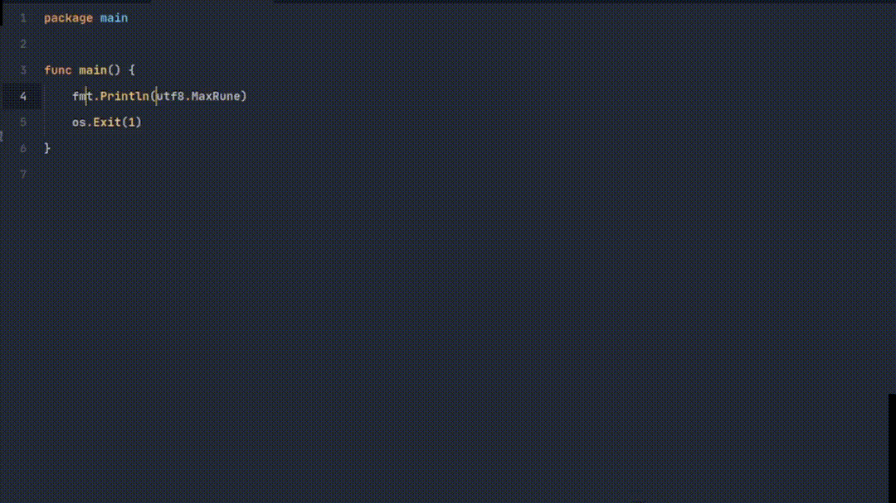

Auto import keywords, or remove unused imports of golang in sublime text.

## Demo

<div align="center">
  
</div>

Finds imports from:
- Opened project path(if has `go.mod`)
- Go library itself(`/usr/lib/go/src`)
- Installed packages(`~/go/pkg/mod/cache/download`)

## Installation

Clone the repository inside sublime's Packages folder(open command plette, search and click on `Browse packages`):

```sh
git clone https://github.com/amirHossein5/go-import.git
```

Or you may clone latest release:

```sh
git clone -b v0.1.0 https://github.com/amirHossein5/go-import.git
```

## Default key bindings

For modifing key bindings open command plette then `GoImport: Edit key bindings`. 

Available Default key bindings:

- `alt+i` -> command: `go_import`
- `alt+e` -> command: `go_import_erase_unused`

## Commands

Available commands:

- `go_import`: Import libs under cursor(s).
- `go_import_erase_unused`: Removes unused imports.

## LICENCE

Licensed under the [MIT license](https://opensource.org/licenses/MIT).
