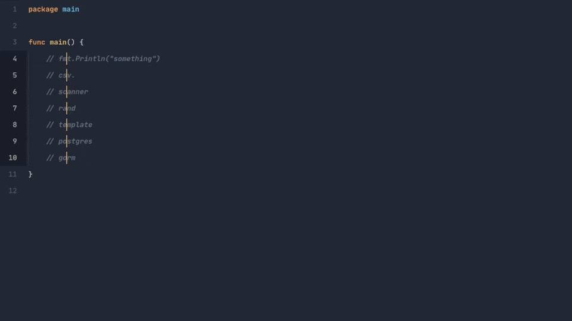

Auto import keyword, or remove unused imports of golang in sublime text.

## Demo

<div align="center">
  
</div>

## Installation

Clone the repository inside sublime's Packages folder(open command plette, search and click on `Browse packages`):

```sh
git clone https://github.com/amirHossein5/go-import.git
```

## Commands

Available commands:

- `go_import`: Import libs under cursor(s).
- `go_import_erase_unused`: Removes unused imports.

## Default key bindings

For modifing key bindings open command plette then `GoImport: Edit key bindings`. Available Default key bindings:

- `alt+i` -> `go_import`
- `alt+e` -> `go_import_erase_unused`
